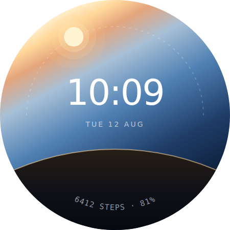
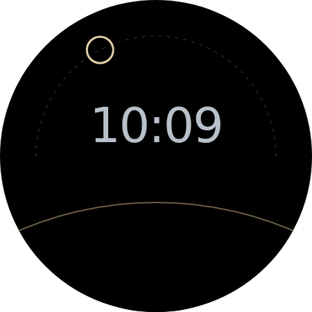
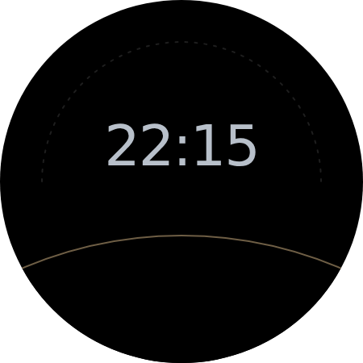

# Day Arc

A Wear OS watch face for the Pixel Watch. The dial is a sky: the sun orbits it
once a day, setting behind the curve of a planet, with the time in the air above
the horizon and the complications on an arc that follows the display's own edge.

Built with [Watch Face Format](https://developer.android.com/training/wearables/wff) —
declarative XML, no Kotlin, no Java. The whole face is one file:
[`app/src/main/res/raw/watchface.xml`](app/src/main/res/raw/watchface.xml).



## The rules it's built on

**No straight edges.** A circular display punishes rectangular thinking. Every
boundary on this dial is either an arc concentric with the screen or a gradient
with no edge at all. The horizon is the limb of a planet, not a chord across
the face — an earlier draft cut the sky off with a horizontal line and it read
exactly like what it was, a square layout pasted into a round hole.

**The rim is load-bearing.** The sun's path *is* the display's edge, and the
step/battery readout curves along a concentric arc at r=186 rather than sitting
on a flat baseline. The shape isn't decorated; it's used.

**Dark by default.** The Pixel Watch's display sits inside a black bezel, and
its OLED blacks are genuinely off. A black ground makes bezel and screen read as
one continuous disc; a light ground turns the bezel into a visible grey donut
around a shrunken screen.

**Ambient designed alongside, not after.** Stripped to always-on, the face keeps
the horizon curve, the sun track and the time, and drops everything else. A
concept that can't survive that isn't finished.

## Ambient

| Sun up — 10:09 | Sun set — 22:15 |
|---|---|
|  |  |

Ambient is a **separate drawing, not a dimmed one**. Dimming a filled sun still
leaves a filled disc — the wrong shape and the wrong power budget. So the
always-on face has its own elements: the sun becomes a ring, the numerals go
`THIN` and cool, the sky and the earth's gradient disappear entirely, and the
horizon survives as a hairline. The sun keeps its orbit, at the same centre and
radius, so nothing jumps when the screen wakes.

WFF's `<Variant>` only knows one mode, `AMBIENT`, so there's no "interactive"
variant to switch on. The idiom is to invert the default instead — ambient-only
parts sit at `alpha="0"` and get raised:

```xml
<PartDraw name="sun_ambient" alpha="0" ...>
    <Variant mode="AMBIENT" target="alpha" value="255" />
    <Ellipse x="206" y="33" width="38" height="38">
        <Stroke color="#FFE0CFA8" thickness="3" />
    </Ellipse>
</PartDraw>
```

The ambient earth is **filled solid black rather than hidden**, which looks like
a waste until you notice the second image: the sun has to actually *set*. A
hidden earth would let the ring show through at night. On OLED those pixels are
off, so the occluder costs nothing.

Around 3% of the disc is lit in ambient, nearly all of it the numerals. Part
`alpha` multiplies the stroke's own alpha rather than replacing it, so the
ambient values are chosen backwards from the effective ones — the track's stroke
is already 20% white, so `alpha="150"` lands it at ~12%.

## One thing worth knowing up front

**Wear OS has no sunrise or sunset data source.** The full list of Watch Face
Format sources covers time, date, moon phase, health, battery, sensors and
weather — sunrise and sunset aren't among them.

So the sun here doesn't track real daylight. It makes a clean 24-hour orbit:
midnight at the bottom (hidden behind the earth), noon at the top, 6am at 9
o'clock, 6pm at 3 o'clock. This is arguably the better design — it needs no
network, no location permission and no fallback path, and it's never wrong the
way a hardcoded daylight window would be at the wrong latitude or season.

The whole thing is driven by a single rotation:

```xml
<Transform target="angle" value="([SECONDS_IN_DAY] / 240) + 180" />
```

`360 / 86400 = 1/240`, and the `+180` puts midnight at the bottom. The sky
gradient lives *inside* that same rotating group, so its warm end always points
at the sun. At night the warm end is buried behind the earth and only the deep
blue end is visible. No colour interpolation anywhere — the light just moves.

If you later want real daylight, `WEATHER.IS_DAY` and the hourly
`WEATHER.HOURS.{n}.IS_DAY` forecast (format version 2+) can be scanned for the
day/night transition. That's a real upgrade path, but it adds a weather
dependency and a fallback for when the data isn't there.

## Build

Requires Android Studio (or a local Android SDK) — this repo has the Gradle
build files but no wrapper jar, so let Android Studio generate one on first
sync, or run `gradle wrapper` if you have Gradle installed.

```bash
# open pixel-day-arc/ in Android Studio, or:
./gradlew assembleDebug
```

## Install on a watch

```bash
# pair over Wi-Fi first: Settings > Developer options > Wireless debugging
adb connect <watch-ip>:<port>
adb install -r app/build/outputs/apk/debug/app-debug.apk
```

Then long-press the current face on the watch and pick Day Arc from the
carousel. The Wear OS emulator in Android Studio works the same way and is
faster to iterate against.

## Validate

Watch Face Format fails at *runtime* rather than build time, so a typo lands as
an invisible element rather than a compiler error. Validate against Google's
published schema instead:

```bash
./tools/validate.sh
```

This clones the spec into `.wff-spec/` on first run and checks the face with
Xerces (the schema uses XSD 1.1 assertions, so the JDK's built-in validator
won't do). The committed `watchface.xml` passes clean against format version 1.

Worth running before every install — it catches the things that are otherwise
silent, and the schema is stricter than the docs suggest. A few that bit during
the build: gradients nest inside `<Fill>` rather than sitting beside it,
`<Stroke>` takes `thickness` rather than `width`, `<Font>` has no
`letterSpacing` attribute at all, and `<Variant>` belongs on the part rather
than on the shape or font inside it.

## Layout

```
pixel-day-arc/
├── app/src/main/
│   ├── AndroidManifest.xml            resource-only bundle, hasCode=false
│   └── res/
│       ├── raw/watchface.xml          the entire watch face
│       ├── xml/watch_face_shapes.xml  450x450 circular
│       ├── xml/watch_face_info.xml
│       ├── drawable/preview.png       rendered from design/
│       └── values/strings.xml
├── design/
│   ├── day-arc-1009.svg               geometry source of truth
│   ├── day-arc-ambient-1009.svg       always-on, sun up
│   ├── day-arc-ambient-2215.svg       always-on, sun set
│   └── ambient-*.png                  rendered from the two above
└── tools/
    ├── validate.sh                    XSD validation
    └── render-preview.mjs             SVG -> PNG for all three
```

`design/day-arc-1009.svg` is not decoration — every number in it has a
counterpart in `watchface.xml` (orbit radius 173, earth ellipse centred at
(225, 1019) with radii 600×727, complication arc at r=186 spanning 222°→138°).
Change the geometry in one place and change it in the other. `preview.png` is
rendered from that SVG rather than exported by hand, so it can't drift:

```bash
node tools/render-preview.mjs
```

## Not done yet

- **12-hour time.** Currently hardcoded to 24-hour via `HOUR_0_23_Z`. Needs a
  `[IS_24_HOUR_MODE]` condition and a second text element.
- **Configurable complications.** Steps and battery are fixed. Real complication
  slots would let people choose, but the arc then has to tolerate any string
  length people drop into it.
- **Burn-in.** The ambient numerals sit in a fixed spot. Wear OS shifts the
  whole face periodically to compensate, but if it proves insufficient the time
  could drift a few pixels on a slow cycle of its own.
- **Preview font.** `preview.png` renders through the container's default sans,
  not the watch's system font, so it isn't pixel-exact. Replace it with a real
  screenshot once the face runs on hardware.
